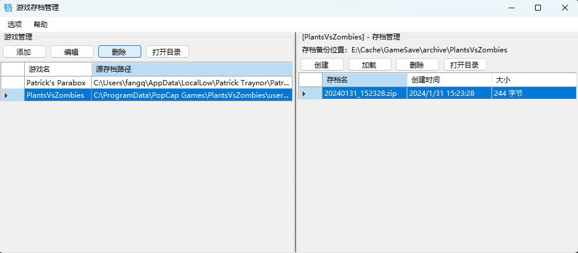
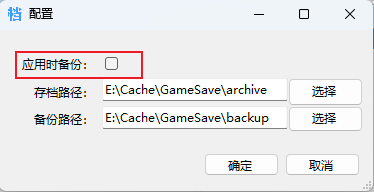

# 游戏存档管理器 Game-Archive-Manager 

## 使用说明

1、游戏管理中，添加游戏以及该游戏的存档路径

2、在存档管理创建存档，所创建的存档位于“存档路径”

3、存档管理中，选中存档并加载即可覆盖游戏源存档文件

选中“应用时备份”可以在加载时对源存档进行备份，备份的文件位于“备份路径”

## License

[MIT](https://github.com/HeMOua/Game-Archive-Manager/blob/master/LICENSE.txt) © HeMOua
